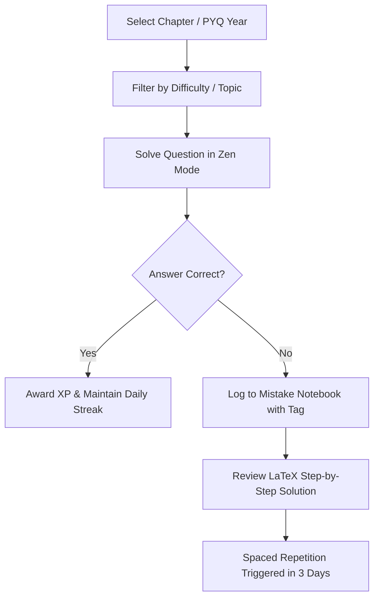
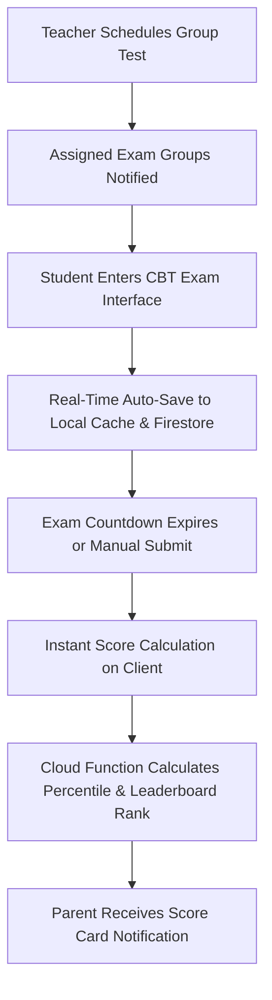

# Marks App — Product & Engineering Specification

> **Document Version**: 5.0.0  
> **Status**: Approved for Engineering & AI Autonomous Agents  
> **Target Platform**: Modern Desktop Web, Tablet (iPad/Android), Mobile PWA  

---

## 1. Executive Summary & Vision

**Marks App** is a next-generation competitive exam preparation and coaching intelligence platform designed to replace legacy, fragmented test series software. Built specifically for high-stakes Indian national entrance exams (**JEE Main, JEE Advanced, NEET-UG, BITSAT, WBJEE, MHT-CET**), Marks App provides:

1. **Aspirants**: An authentic, low-latency NTA-style Computer-Based Testing (CBT) engine paired with deep mistake diagnosis, chapter-wise Daily Practice Problems (DPP), previous year question (PYQ) banks, and formula notebooks.
2. **Coaching Institutes & Faculty**: A multi-branch coaching ERP allowing batch management, custom test creation, attendance tracking, student progress monitoring, and seamless communication with parents.
3. **Parents**: Transparent, real-time insights into student effort, score distribution, attendance consistency, and teacher remarks.

---

## 2. Target Exams & Syllabus Taxonomies

### 2.1 Exam Categorization
- **JEE Main**: Physics, Chemistry (Organic, Inorganic, Physical), Mathematics. Total 300 marks (75 questions; 20 Single Choice + 5 Numerical per subject out of 10 choices).
- **JEE Advanced**: Deep multi-concept questions, Multi-Correct MCQs, Numerical Value Type (Decimal/Integer), Matrix Match, Comprehension-based paragraph questions. Dynamic marking schemes including partial marking.
- **NEET-UG**: Physics, Chemistry, Botany, Zoology. Total 720 marks (180 questions out of 200; Section A 35 compulsory + Section B 10/15 optional per subject).
- **BITSAT**: Physics, Chemistry, Mathematics/Biology, English Proficiency, Logical Reasoning (130 questions).

### 2.2 Pedagogical Taxonomy Tree
```
Exam (e.g., JEE Main)
└── Subject (e.g., Physics)
    └── Chapter (e.g., Electrostatics)
        └── Topic (e.g., Gauss's Law & Electric Flux)
            └── Sub-Topic (e.g., Field due to Infinite Charged Cylinder)
```

---

## 3. Problem Statement & Core Value Propositions

| Existing Coaching / EdTech Pain Point | Marks App Engineered Solution |
|---|---|
| **Distorted NTA Simulation**: Mock apps do not match actual NTA CBT screen dimensions, button placements, or navigation rules. | **Pixel-Accurate CBT Engine**: Exact layout, color-coded question palette, section switching, timer countdowns, and warning modals. |
| **Superficial Analytics**: Apps only show total score and percentile without root cause diagnostics. | **Mistake Notebook & Diagnostic Taxonomy**: Pinpoints whether errors were caused by *Conceptual Gaps*, *Calculation Mistakes*, *Silly Overlooks*, or *Time Pressure*. |
| **Scattered Math & Chemistry Rendering**: Formulas load as slow raster images or broken symbols. | **Vector-Accurate KaTeX Typesetting**: Native rendering of LaTeX equations, chemical symbols (`mhchem`), matrices, and integrals in milliseconds. |
| **Disconnected Stakeholders**: Teachers, students, and parents operate on separate platforms or paper records. | **Unified 4-Role Cloud Ecosystem**: Single codebase, role-based isolation, instant parent alerts, and faculty dashboards. |

---

## 4. Core User Loops

### 4.1 The Aspirant Practice Loop


### 4.2 The Live Group Test Loop


---

## 5. Performance Benchmarks & Engineering SLAs

| Metric | Target SLA | Enforcement Mechanism |
|---|---|---|
| **First Contentful Paint (FCP)** | `< 1.2s` | Vite bundle splitting, tree-shaking, Google Fonts preconnect |
| **Time to Interactive (TTI)** | `< 2.0s` | Lazy-loaded routes (`React.lazy`), defer heavy chart bundles |
| **Exam Engine Input Latency** | `< 16ms (60 FPS)` | Local React state for palette navigation; non-blocking Firestore sync |
| **KaTeX Math Render Time** | `< 5ms per equation` | Pre-parsed string memoization, minimal re-renders |
| **Offline Resilience** | Full exam completion | LocalStorage + IndexedDB backup during test sessions |
| **Concurrent Test Takers** | `10,000+ simultaneous` | Firestore read caching, Cloud Functions batch re-ranking |

---

## 6. System Boundaries & Technology Principles

1. **Zero Mock Data Principle**: No hardcoded test responses or simulated state. All data operations interface with Firestore collections (`users`, `groupTests`, `groupTestAttempts`, `custom_questions`, etc.).
2. **Immutable Audit Trail**: All administrative and faculty actions (question deletion, test modifications, role assignments) create unalterable documents in `auditLogs/{id}`.
3. **Role Namespace Discipline**:
   - `/app/*`: Student domain
   - `/teacher/*`: Teacher domain
   - `/admin/*`: Admin domain
   - `/parent/*`: Parent domain
4. **Security Hardening**: No client-side role elevation. All privilege transitions use server-verified invite codes or Firebase Auth custom claims.
