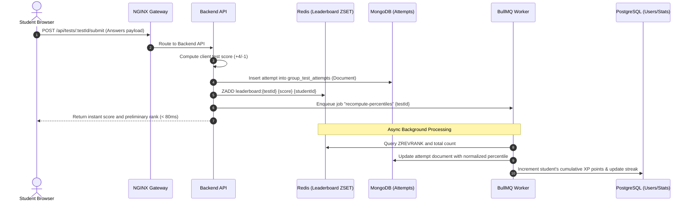

# Enterprise Hybrid Architecture Specification — Marks App

> **Architecture Paradigm**: Polyglot Persistence + Headless CMS + Low-Code Internal Operations  
> **Containerization**: Docker & Docker Compose Microservice Network  

---

## 1. Executive Architecture Summary

To support millions of JEE/NEET aspirants across hundreds of multi-branch coaching institutes with sub-millisecond latencies, Marks App utilizes an **Enterprise Polyglot Architecture**:

```
                                  [ HTTPS / DNS (Cloudflare / Domain) ]
                                                    │
                                                    ▼
                                    [ NGINX Reverse Proxy & Gateway ]
                                        (Port 80 / 443 — Rate Limiting)
                                                    │
        ┌───────────────────┬───────────────────────┼────────────────────────┬───────────────────┐
        ▼                   ▼                       ▼                        ▼                   ▼
 [ Frontend SPA ]   [ Backend API ]         [ Payload CMS ]          [ Appsmith Ops ]   [ Meilisearch ]
 (React 18 + Vite)  (Express/BullMQ)        (Headless Content)       (Internal Tools)   (Full-Text Search)
   Port: 5173         Port: 4000              Port: 3000               Port: 8090          Port: 7700
        │                   │                       │                        │                   │
        │                   ├───────────────────────┴────────────────────────┤                   │
        │                   │                                                │                   │
        ▼                   ▼                                                ▼                   ▼
[ Client Browser ]  ┌───────────────┐                                ┌───────────────┐   ┌───────────────┐
                    │  PostgreSQL   │                                │    MongoDB    │   │     Redis     │
                    │ Core Relational│                               │ Question Bank │   │ Cache & ZSET  │
                    │   (Port 5432) │                                │  (Port 27017) │   │  (Port 6379)  │
                    └───────────────┘                                └───────────────┘   └───────────────┘
```

---

## 2. Polyglot Persistence & Data Distribution Matrix

| Data Domain | Storage Engine | Technology Choice Rationale |
|---|---|---|
| **Institutes, Branches, Batches** | **PostgreSQL 16** | Strict foreign key constraints, cascading deletions, ACID transactions. |
| **Users & RBAC Roles** | **PostgreSQL 16** | Relational user-to-batch and parent-to-student mapping with indexed lookups. |
| **Attendance Records** | **PostgreSQL 16** | Unique constraint on `(batch_id, student_id, date)` preventing duplicate logs. |
| **Questions & TeX Solutions** | **MongoDB 7.0** | Flexible JSON document model for LaTeX strings, variable option sets, diagrams. |
| **CBT Test Attempts** | **MongoDB 7.0** | High-volume write throughput during bulk student submissions; nested response maps. |
| **Real-Time Leaderboards** | **Redis 7.2 (ZSET)** | `O(log N)` rank computation via Sorted Sets (`ZADD`, `ZREVRANGE`, `ZREVRANK`). |
| **Exam State & Answer Buffer** | **Redis 7.2 (Hash)**| In-memory sub-millisecond write buffering during active test sessions. |
| **Curated Study Content & Formulas** | **Payload CMS** | Headless TypeScript content curation with editorial workflow and media uploads. |
| **Internal Operations & Billing** | **Appsmith CE** | Rapid low-code backoffice for institute admins, support staff, and verification. |
| **Question Bank Search** | **Meilisearch** | Typo-tolerant sub-10ms search across 50,000+ questions by chapter, topic, or keyword. |

---

## 3. High-Concurrency Flow: Test Submission & Processing



---

## 4. Key Architectural Advantages

1. **Relational Integrity for ERP**: Institutes, faculty assignments, and attendance logs benefit from PostgreSQL ACID transactions and foreign keys.
2. **Document Flexibility for Content**: Questions with arbitrary options, formulas, images, and solutions do not suffer from rigid table migration bottlenecks.
3. **Instantaneous Rankings**: Redis Sorted Sets eliminate expensive `SELECT COUNT(*) WHERE score > X` SQL table scans during high-stakes exams.
4. **Decoupled Internal Dashboards**: Appsmith allows support teams to debug payments and manage institute accounts without writing bespoke frontend code.
5. **Headless Editorial Control**: Non-technical subject matter experts use Payload CMS to author questions and formula sheets with live rich-text previews.
