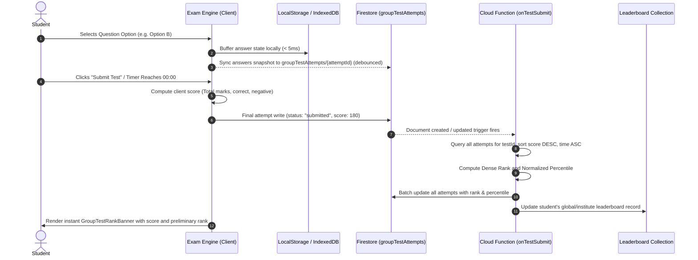

# System Architecture — Marks App

> **Architecture Style**: Serverless Jamstack + Real-time Reactive Cloud Backend  
> **Ecosystem**: EduAI V5 Unified Platform  

---

## 1. High-Level Architecture Overview

Marks App adopts a decoupled, event-driven serverless architecture. The client is a high-speed Single Page Application (SPA) built with React 18, Vite, and Tailwind CSS v4, deployed to Firebase Global CDN. All persistence, real-time sync, and security enforcement are handled by Google Cloud Firestore, while background computations (ranking, audit logging, streak resets) execute via Cloud Functions for Firebase.

```
[ Client Layer (React 18 SPA) ]
  ├── Student Interface (/app)
  ├── Teacher Console (/teacher)
  ├── Admin Panel (/admin)
  └── Parent Portal (/parent)
            │
            ▼  (Secure WebSockets & HTTPS via Firebase SDK v12)
[ Security & Rule Engine ]
  └── Firestore Security Rules (RBAC, Token claims, Document validations)
            │
            ▼
[ Cloud Persistence Layer ]
  ├── Firestore NoSQL Database (Collections & Subcollections)
  ├── Firebase Cloud Storage (PDF papers, Question Diagrams, Avatars)
  └── Firebase Authentication (JWT Tokens, Custom Claims)
            │
            ▼ (Event Triggers: onCreate, onUpdate, Pub/Sub)
[ Serverless Compute (Cloud Functions v2) ]
  ├── onTestSubmit (Rank, Percentile & Leaderboard Recalculation)
  ├── assignRole (Server-verified Role Token Claim)
  └── dailyStreakReset (Daily cron maintenance)
```

---

## 2. C4 Architecture Model

### 2.1 Context Diagram (System & Actors)
- **Aspirants (Students)**: Attempt CBT exams, solve chapter PYQs, analyze weak areas, manage mistake notebook.
- **Faculty (Teachers)**: Create and schedule tests, mark attendance, review attempts, input remarks.
- **Institute Admins**: Oversee branches, batches, manage question banks, review faculty questions, inspect audit logs.
- **Parents**: Review child scorecards, track attendance consistency, view faculty feedback.
- **External Systems**:
  - Firebase Auth / Google Identity Platform
  - Google Cloud Storage Bucket
  - Anthropic / Gemini API (PDF Question OCR parsing)

### 2.2 Container Diagram
- **Web Client (SPA)**: Bundled via Vite, runs in modern browsers; manages routing via `react-router-dom`, math rendering via KaTeX, animations via `motion/react`, and state via React hooks.
- **Firestore DB**: Real-time NoSQL store partitioned into core entities, coaching hierarchy, question banks, and activity logs.
- **Cloud Functions**: Node.js microservices handling heavy aggregations and secure privilege operations.

---

## 3. Data Flow: Live CBT Test Lifecycle



---

## 4. Client-Side State & Offline Resilience

### 4.1 Exam Engine State Machine
```
[ NOT_STARTED ] ──(Click Start)──► [ IN_PROGRESS ] ◄──(Answer/Mark)──► [ LOCAL_CACHE_SYNC ]
                                          │
                               (Timer Expiry / Click Submit)
                                          │
                                          ▼
                                   [ SUBMITTING ]
                                          │
                                (Cloud Write Acknowledged)
                                          │
                                          ▼
                                    [ EVALUATED ]
```

### 4.2 Network Interruption Protection
1. **Double Buffering**: Every response is written immediately to `localStorage` key `exam_attempt_{testId}` before invoking Firestore network calls.
2. **Crash Recovery**: If the student's browser is accidentally closed or refreshed, the engine inspects `localStorage`, restores all option selections, and resumes the countdown timer based on server-synchronized start timestamps.
3. **Queue-on-Offline**: If the client loses connection during submit, the attempt object is saved locally; an online listener detects reconnect and flushes the attempt automatically.

---

## 5. Security & Boundary Architecture

1. **Client Isolation**: Student users cannot directly query other students' attempts or private test keys prior to publication.
2. **No Email-Based Privileges**: All elevated administrative rights require `role == "admin"` stored in the user's Firestore document and mirrored into custom claims.
3. **Immutable Audit Trails**: Actions performed in `/admin` or `/teacher` generate append-only documents in `auditLogs/{id}` with rules prohibiting updates or deletions (`allow update, delete: if false;`).
